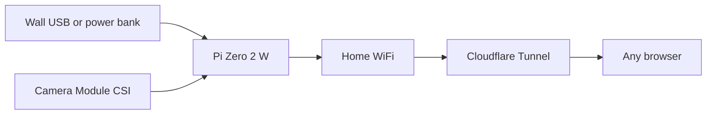

# Pi Zero 2 W CCTV deployment

Recommend a Pi Zero 2 W + CSI camera for this one-cam MJPEG app, add a picamera2 capture backend so the Camera Module works, and automate two daily 10-minute on-windows with Cloudflare Tunnel via systemd (soft idle between windows).

## Implementation checklist

- [ ] Add `backend: opencv | picamera2` to `CameraConfig` and implement picamera2 capture/JPEG path in `app/camera.py`
- [ ] Document Pi Zero 2 W setup: apt picamera2, `--system-site-packages` venv, headless OpenCV notes, config example
- [ ] Add `deploy/pi` systemd units + timers for two daily 10-minute windows starting/stopping app and cloudflared
- [ ] Document named Cloudflare tunnel with stable hostname (quick tunnels unsuitable for scheduled starts)

## Hardware recommendation

**Use a Raspberry Pi Zero 2 W, not the original Pi Zero W.**

| Board | Verdict |
|-------|---------|
| Pi Zero W (original) | Skip for this app — single-core + OpenCV/MJPEG + `cloudflared` is too tight; Camera Module 3 support is weak |
| **Pi Zero 2 W** | **Best fit** — same tiny form factor as your other Zero project, quad-core enough for one 480p stream, low enough draw for occasional power-bank use |
| Pi 4 / 5 | Fine but hotter, hungrier, and larger than you need for one scheduled camera |

**BOM**
- Raspberry Pi Zero 2 W (+ headers if you want HATs later)
- Raspberry Pi Camera Module **2 or 3** + **Zero-compatible** CSI ribbon (the short/narrow cable sold for Zero)
- MicroSD (16 GB+), official 5V micro-USB PSU for wall power
- Optional: small USB power bank for temporary placement (micro-USB in)
- Optional later: DS3231 RTC HAT only if you want true power-off between windows

**Power reality**
- Active window (camera + encode + Wi‑Fi + tunnel): roughly a few hundred mA on Zero 2 W
- Idle between windows (OS up, app/tunnel stopped): still ~100–200 mA — **not deep sleep**
- With only **~20 minutes active/day**, wall power is ideal; a power bank is reasonable for **temporary** placement (hours, not days of unattended idle)
- True “off until alarm” needs an RTC wake HAT or an external timed USB power source — out of scope for v1



## What must change in the app

Today capture is OpenCV-only via `device_index` in [`app/camera.py`](app/camera.py) — that targets USB/V4L2, not the Pi Camera Module’s libcamera stack.

**Add a `picamera2` backend** (keep OpenCV for your macOS USB workflow):

- Extend [`CameraConfig`](app/config.py) with e.g. `backend: opencv | picamera2` (default `opencv`)
- In [`app/camera.py`](app/camera.py), branch `_open_capture` / capture loop:
  - `opencv`: current `cv2.VideoCapture(device_index)` path
  - `picamera2`: configure still/video size + fps, grab frames, JPEG-encode (prefer Picamera2’s JPEG path if straightforward; otherwise array → `cv2.imencode` as today)
- Pi [`config.yaml`](config.yaml) example:

```yaml
cameras:
  - id: front-door
    name: Front Door
    backend: picamera2
    width: 854
    height: 480
    fps: 10
    jpeg_quality: 70
```

- Dependencies: on Raspberry Pi OS, install `python3-picamera2` via apt and create the project venv with `--system-site-packages` (picamera2 is awkward as a plain pip dep). Keep `opencv-python` for macOS; on Pi prefer `opencv-python-headless` if OpenCV is still used for encode/fallback.
- Docs: short **Raspberry Pi** section in [`README.md`](README.md) (enable camera, Wi‑Fi, SSH, venv, run, tunnel) — you still manage the box over SSH as you intended.

No Docker. No multi-cam scope.

## Schedule: two daily 10-minute windows (“sleep” = soft idle)

**Concrete approach:** leave the Pi powered; **only run the app + tunnel during two configurable windows**. Outside those windows, stop both so the camera and Cloudflare process are off (software sleep / idle).

Ship installable unit/timer templates under something like `deploy/pi/`:

1. `personal-cctv.service` — runs `uvicorn` from the project venv, `HOST=127.0.0.1`
2. `cloudflared-cctv.service` — runs `cloudflared tunnel --url http://127.0.0.1:8000` (or a named tunnel if you already have one)
3. Two `OnCalendar=` timers (e.g. morning / evening) that start both services, plus a oneshot/timer that **stops them after 10 minutes**
4. A small env/config file for the two local times (e.g. `08:00` and `18:30`) so you can edit times without rewriting units

You SSH in anytime the Pi is powered; during off-windows the viewer/tunnel simply are not running (`/healthz` down, no public URL until the next window — quick tunnels also get a **new URL each start**, so prefer a **named Cloudflare tunnel** with a stable hostname for this schedule).

**Named tunnel (recommended for schedules):** one stable `https://cctv.example.com` that is only useful when the origin is up during the 10-minute windows. Document creating the tunnel once on the Pi and pointing it at `localhost:8000`.

## Ops flow (what you’ll do on the Pi)

1. Flash Raspberry Pi OS Lite (64-bit) with Wi‑Fi + SSH via Raspberry Pi Imager
2. Boot, SSH in, enable camera / ensure libcamera sees the module (`rpicam-hello` / `libcamera-hello`)
3. Clone this repo onto the SD card filesystem
4. `cp .env.example .env`, set password + session secret
5. Install apt packages (`python3-venv`, `python3-picamera2`, `cloudflared`), create venv with system site packages, `pip install -r requirements.txt` (Pi-adjusted)
6. Install systemd units/timers; set the two daily times
7. Wait for a window (or `systemctl start personal-cctv cloudflared-cctv` to test), open the stable tunnel URL, log in, confirm MJPEG

## Out of scope for this pass

- Hardware RTC deep-sleep / wake-from-halt
- Recording, motion detection, SMS (still roadmap)
- Adapting your existing Pi Zero W project hardware for dual use (buy/use a **Zero 2 W** for CCTV)
- Battery charge management circuitry
- Pan-tilt remote aiming (see below)

## Future feature: remote pan-tilt aim

Add a movable camera mount and control it from the password-protected web UI so you can aim the camera during a live session.

**Hardware candidate:** [Adafruit Mini Pan-Tilt Kit (assembled, with micro servos)](https://www.pishop.ca/product/mini-pan-tilt-kit-assembled-with-micro-servos/) — ~180° pan, ~150° tilt, 38×36 mm mount plate for the Camera Module. Uses two SG-90/SG-92-style analog servos.

**Likely software shape (when built)**
- Drive servos from Pi GPIO (PWM via `gpiozero` / `pigpio`, or a small servo HAT if GPIO timing proves noisy under load)
- Authenticated API routes (e.g. set pan/tilt angles or nudge left/right/up/down) gated by the existing session cookie
- Simple on-stream controls in the viewer (arrows / sliders) while MJPEG is live
- Config for GPIO pins, angle limits, and a default “home” pose on service start
- Only energize servos during the active 10-minute windows (or briefly on command) to cut idle draw and servo buzz

**Notes / constraints to revisit then**
- Pi Zero 2 W needs soldered headers (or a pre-headered board) for servo signal + 5V/GND wiring
- Servos can spike current — prefer a supply that can handle motor + Pi together, or separate servo 5V with common ground
- Pan-tilt + camera ribbon routing needs a short Zero CSI cable and strain relief so the ribbon does not flex to failure
